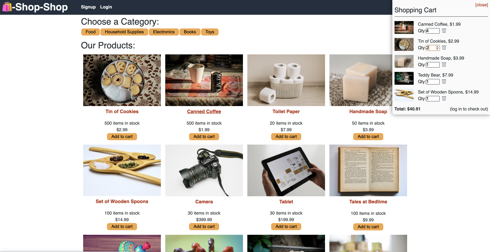
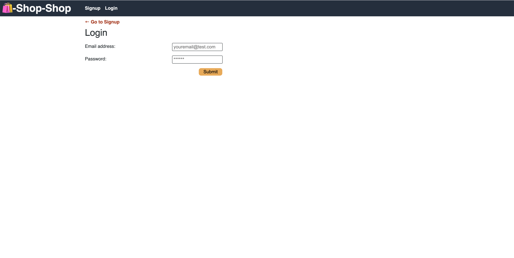
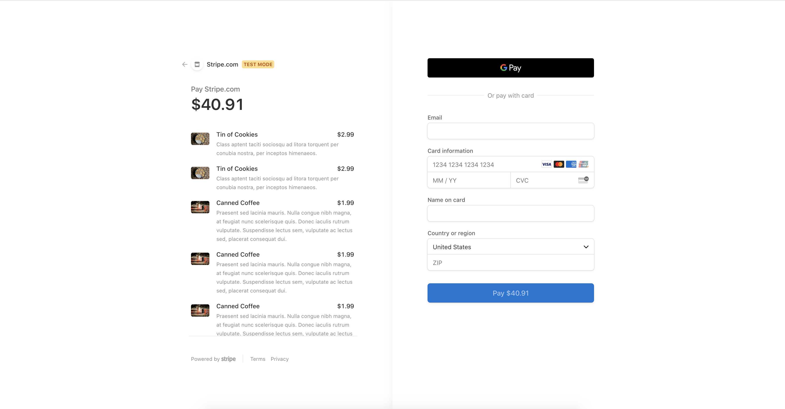

# Shop-Shop

## Description
Shop-Shop was an existing e-commerce platform that was provided to me in an assignment from the UW Extended Coding Bootcamp. My task was to centralize all of the application's data in state globally to make it easier to share state across the entire application. I also created a shopping cart for the application, added offline functionality, and processed secure online payments with a service called Stripe.

<!-- After learning to manage global state using React's Context API, I refactored the platform so that it uses Redux. -->

## Table of Contents
[Installation](#Installation)  
[Screenshots](#Screenshots)  
[Contact](#Contact)

## [Installation](#Installation)
To use Shop-Shop, visit https://quiet-anchorage-56583.herokuapp.com/.

## [Screenshots](#Screenshots)
This is the initial homepage where you can add items to your cart. You must login to be able to checkout and/or see your Order History.  

 

This is the Login page. The Sign Up page is very similar with a few additional fields to create an account.  
  
  

Upon clicking the Checkout button that is in the Cart, this is the page that the user is brought to. The user is prompted to make their payment using Stripe. After they complete their payment they're taken to a Success message page that redirects them to the homepage.  

## [Contact](#Contact)
To see more of my work, visit my GitHub profile: [alirueter](https://github.com/alirueter)

If you have any questions, you can contact me at rueter.alison@gmail.com.
    
